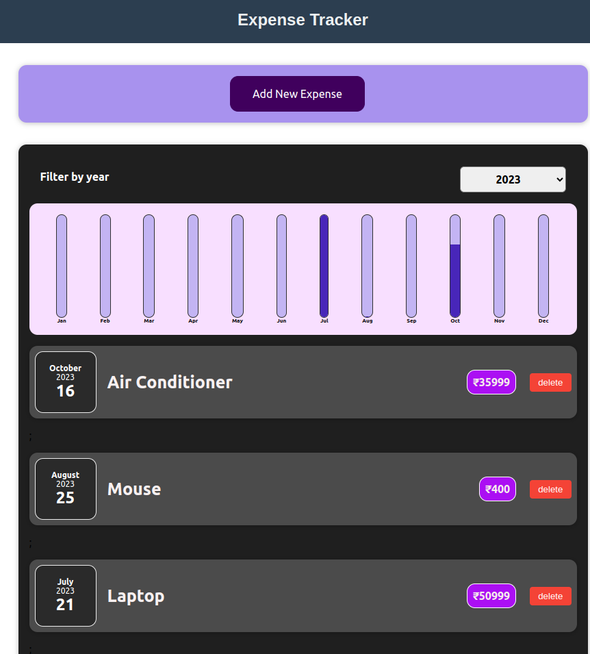

# Expense Tracker




Welcome to Expense Tracker, a web application built with React.js that helps you keep track of your expenses. This expense tracker provides a simple and intuitive interface for managing your financial transactions and monitoring your spending habits.

## Features

- **Expense Categories:** Categorize your expenses for better organization and analysis.
- **Add and Delete Expenses:** Easily add new expenses.
- **Transaction History:** View a list of all your transactions along with the date.
- **Filter and Search:** Filter expenses by category and search for specific transactions.
- **Expense Summary:** Get a quick overview of your total income and expenses.
- **Responsive Design:** Enjoy a seamless experience across different devices and screen sizes.

## Live Demo

You can access the live demo of the Expense Tracker by clicking [here](https://my-expense-tracker-bay.vercel.app/).

## Getting Started

To run the application locally and explore its codebase, follow these steps:

1. Clone the repository:

```bash
git clone https://github.com/ReeveFernandes/Expense-Tracker.git
```

2. Navigate to the project directory:

```bash
cd Expense-Tracker
```

3. Install the dependencies:

```bash
npm install
```

4. Start the development server:

```bash
npm start
```

5. Open your browser and visit [http://localhost:3000](http://localhost:3000) to see the application in action.

## Technologies Used

- React: [^17.0.2](https://reactjs.org/)


